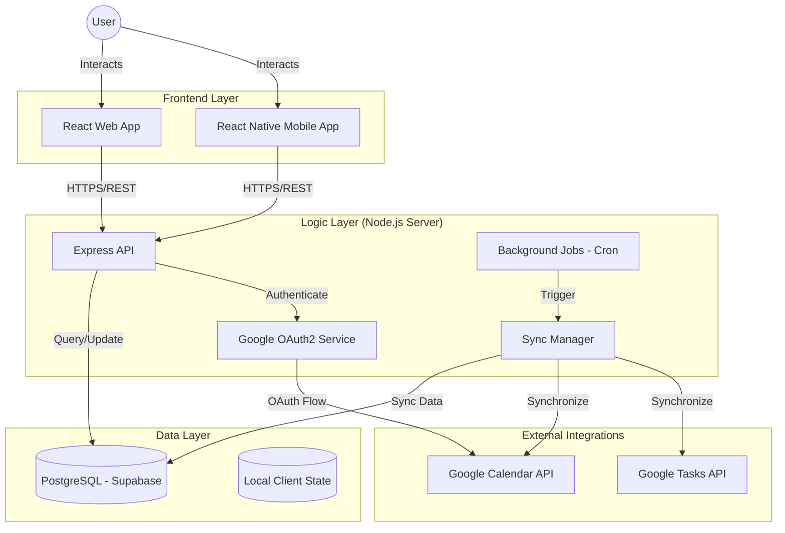

# Planix System Architecture

Planix is a comprehensive personal management platform that synchronizes with Google services to provide a seamless experience for managing events, tasks, and reminders.

## System Overview

The application follows a modern client-server architecture with a clear separation of concerns between the frontend, backend, and various external integrations.



## Technology Stack

### Frontend
- **Web**: React 19, Vite, Tailwind CSS 4, Framer Motion, Lucide Icons.
- **Mobile**: React Native (Expo environment pattern).
- **State management**: React Context API (Auth, Event contexts).

### Backend
- **Framework**: Node.js with Express.js.
- **Database**: PostgreSQL (hosted on Supabase).
- **Authentication**: JWT & Google OAuth2.
- **Integration**: Google APIs Node.js Client (googleapis).
- **Scheduling**: node-cron for background reminder processing.

### Shared
- **Utilities**: Date manipulation and validation logic shared across platforms.

## Directory Structure

```text
Planix/
├── client/             # Vite + React Web Application
│   ├── src/
│   │   ├── components/ # Reusable UI components & layouts
│   │   ├── context/    # Global state (Auth, Events)
│   │   ├── pages/      # Route-level components
│   │   └── services/   # API abstraction layer
├── server/             # Node.js + Express Backend
│   ├── src/
│   │   ├── config/     # Database and OAuth configurations
│   │   ├── controllers/# Route handlers
│   │   ├── jobs/       # Background workers (Reminders)
│   │   ├── models/     # Database interaction logic (Raw SQL)
│   │   ├── routers/    # API endpoint definitions
│   │   └── services/   # Business logic (Google Sync)
├── mobile/             # React Native Application
├── Database/           # SQL schema and migration scripts
└── shared/             # Code shared between client and server
```

## Data Synchronization Workflow

One of the core features of Planix is its bi-directional synchronization with Google.

1.  **Initial Sync**: When a user logs in via Google, their primary calendar and task lists are fetched and stored in the Planix database.
2.  **Creation/Update**: When a user creates or edits an event in Planix, the system immediately pushes the update to Google APIs. If successful, it updates the local database.
3.  **Conflict Handling**: The system uses `google_event_id` as a unique identifier to ensure data consistency between the local database and Google's servers.
4.  **Automatic Resync**: The dashboard periodically checks for updates to ensure the local view remains current with any changes made directly on Google Calendar.
